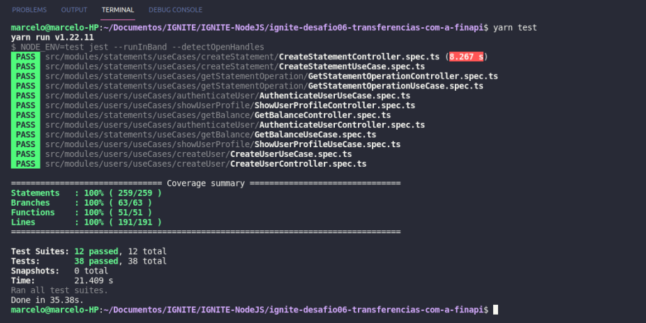

### ignite-desafio06-transferencias-com-a-finapi

# Desafio 01 - Transferências com a FinAPI
## Chapter V


### Sobre o desafio

Foi feito a implementação de uma nova funcionalidade na FinAPI, a aplicação que foi testada durante o desafio **[Testes unitários](https://www.notion.so/Desafio-01-Testes-unit-rios-0321db2af07e4b48a85a1e4e360fcd11)**.

A nova funcionalidade permiti a transferência de valores entre contas.


### Alguns requisitos cumpridos:
- Só possível transferir valores superiores ao disponível no saldo de uma conta;
- O balance (obtido através da rota /api/v1/statements/balance) considera também todos os valores transferidos ou recebidos através de transferências ao exibir o saldo de um usuário;

 1 - ```docker-compose up -d```
 
 2 - ```yarn typeorm migration:run```
 
 3 - ```yarn test```
 


<h1 align="center">
    
</h1>


As informações para realizar uma transferência serão:
https://www.notion.so/Desafio-01-Transfer-ncias-com-a-FinAPI-5e1dbfc0bd66420f85f6a4948ad727c2
